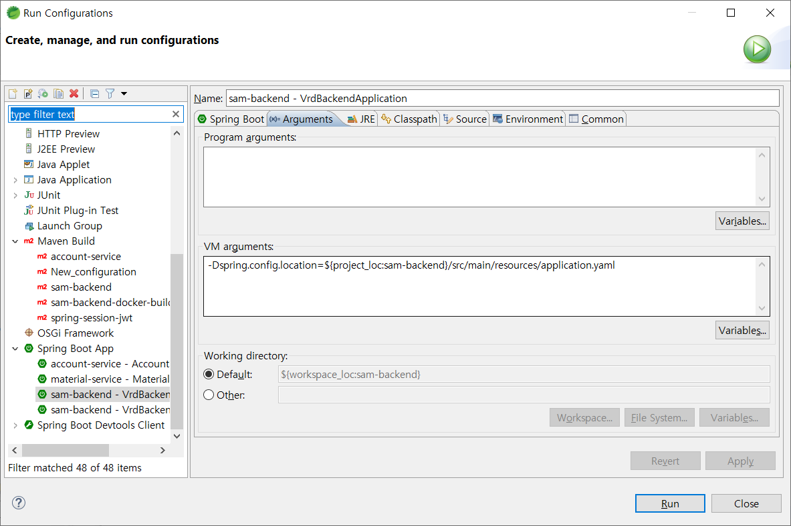
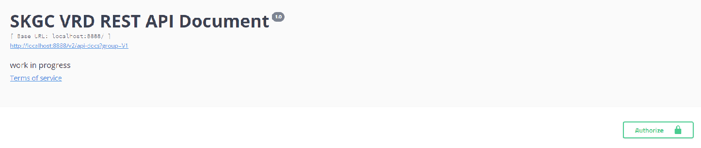
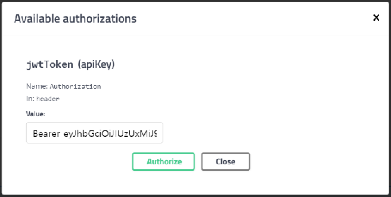

# sam-backend


### Azure openjdk 11 Download
https://repos.azul.com/azure-only/zulu/packages/zulu-11/11.0.3/zulu-11-azure-jdk_11.31.11-11.0.3-win_x64.msi

### STS 개발툴 설정
1. OpenJDK 11을 기본으로 설치 
2. lombok 설치
   Maven Dependencies 내의 lombok.jar 파일 우클릭 후 Java Application 실행 후 STS 설치 위치에 install)
3. Run Congfigurations -> maven build 시  Skip Test 체크
4. Run Congfigurations -> Spring boot App -> JRE Tab 선택 후  VM Args 설정변경(jar 패키징시 application.yaml이 제외되어 있음.k8s)
   -Dspring.config.location=${project_loc:sam-backend}/src/main/resources/application.yaml
   

### Maven build & run
```
mvn clean package -Dmaven.test.skip=true
```

```
mvn spring-boot:run -Dspring.profiles.active=dev
```

### Docker build & run
```
docker build --tag sam-backend .
docker tag sam-backend bekube/sam-backend:latest
docker push bekube/sam-backend:latest
```


```
docker run --rm -p 8080:8080 --name sam-backend  sam-backend:1.0
```
### deploy

- deploy k8s
```
kubectl apply -f ./k8s -n vrd-dev
```
---

### API Test
```
http://localhost:8080/swagger-ui.html
```

1. 로그인 테스트 
 - /api/auth/signin  
 - 테스트 접속 계정 : test/1
 
2. Swagger API Key 입력  
  화면 우측 상단 Authorize 버튼 클릭
   
   1번에서 로그인 결과 항목의 tokenType + 
Access Token을 조합하여 입력 ( ex: Bearer eyJhbGci ... -Ql7hmX8g )
   


---

### k8s
vrd-dev 네임스페이스 조회
```
kubectl get all -n vrd-dev
```
pod 삭제
```
kubectl delete pod sam-backend-64f6ffbc4d-vnb5h -n vrd-dev --grace-period=0
```
